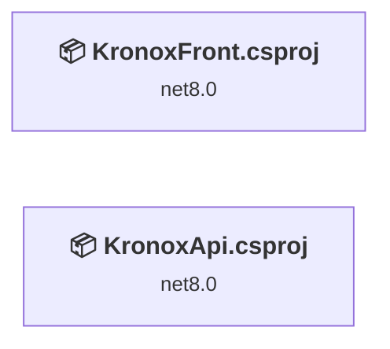
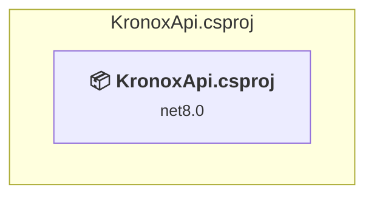
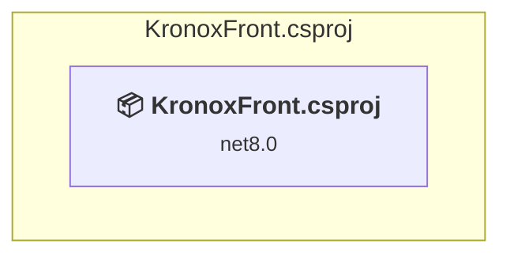

# Projects and dependencies analysis

This document provides a comprehensive overview of the projects and their dependencies in the context of upgrading to .NETCoreApp,Version=v10.0.

## Table of Contents

- [Executive Summary](#executive-Summary)
  - [Highlevel Metrics](#highlevel-metrics)
  - [Projects Compatibility](#projects-compatibility)
  - [Package Compatibility](#package-compatibility)
  - [API Compatibility](#api-compatibility)
  - [Binding Redirect Configuration](#binding-redirect-configuration)
- [Aggregate NuGet packages details](#aggregate-nuget-packages-details)
- [Top API Migration Challenges](#top-api-migration-challenges)
  - [Technologies and Features](#technologies-and-features)
  - [Most Frequent API Issues](#most-frequent-api-issues)
- [Projects Relationship Graph](#projects-relationship-graph)
- [Project Details](#project-details)

  - [KronoxApi\KronoxApi.csproj](#kronoxapikronoxapicsproj)
  - [KronoxFront\KronoxFront.csproj](#kronoxfrontkronoxfrontcsproj)

## Executive Summary

### Highlevel Metrics

| Metric | Count | Status |
| :--- | :---: | :--- |
| Total Projects | 2 | All require upgrade |
| Total NuGet Packages | 5 | 3 need upgrade |
| Total Code Files | 216 |  |
| Total Code Files with Incidents | 32 |  |
| Total Lines of Code | 42888 |  |
| Total Number of Issues | 207 |  |
| Estimated LOC to modify | 202+ | at least 0,5% of codebase |

### Projects Compatibility

| Project | Target Framework | Difficulty | Package Issues | API Issues | Binding Issues | Est. LOC Impact | Description |
| :--- | :---: | :---: | :---: | :---: | :---: | :---: | :--- |
| [KronoxApi\KronoxApi.csproj](#kronoxapikronoxapicsproj) | net8.0 | 🟢 Low | 3 | 46 | 0 | 46+ | AspNetCore, Sdk Style = True |
| [KronoxFront\KronoxFront.csproj](#kronoxfrontkronoxfrontcsproj) | net8.0 | 🟢 Low | 0 | 156 | 0 | 156+ | AspNetCore, Sdk Style = True |

### Package Compatibility

| Status | Count | Percentage |
| :--- | :---: | :---: |
| ✅ Compatible | 2 | 40,0% |
| ⚠️ Incompatible | 0 | 0,0% |
| 🔄 Upgrade Recommended | 3 | 60,0% |
| ***Total NuGet Packages*** | ***5*** | ***100%*** |

### API Compatibility

| Category | Count | Impact |
| :--- | :---: | :--- |
| 🔴 Binary Incompatible | 5 | High - Require code changes |
| 🟡 Source Incompatible | 14 | Medium - Needs re-compilation and potential conflicting API error fixing |
| 🔵 Behavioral change | 183 | Low - Behavioral changes that may require testing at runtime |
| ✅ Compatible | 110908 |  |
| ***Total APIs Analyzed*** | ***111110*** |  |

## Aggregate NuGet packages details

| Package | Current Version | Suggested Version | Projects | Description |
| :--- | :---: | :---: | :--- | :--- |
| MailKit | 4.16.0 |  | [KronoxApi.csproj](#kronoxapikronoxapicsproj) | ✅Compatible |
| Microsoft.AspNetCore.Identity.EntityFrameworkCore | 8.0.14 | 10.0.9 | [KronoxApi.csproj](#kronoxapikronoxapicsproj) | NuGet package upgrade is recommended |
| Microsoft.EntityFrameworkCore.Design | 8.0.14 | 10.0.9 | [KronoxApi.csproj](#kronoxapikronoxapicsproj) | NuGet package upgrade is recommended |
| Microsoft.EntityFrameworkCore.SqlServer | 8.0.14 | 10.0.9 | [KronoxApi.csproj](#kronoxapikronoxapicsproj) | NuGet package upgrade is recommended |
| Swashbuckle.AspNetCore | 8.1.2 |  | [KronoxApi.csproj](#kronoxapikronoxapicsproj) | ✅Compatible |

## Top API Migration Challenges

### Technologies and Features

| Technology | Issues | Percentage | Migration Path |
| :--- | :---: | :---: | :--- |

### Most Frequent API Issues

| API | Count | Percentage | Category |
| :--- | :---: | :---: | :--- |
| T:System.Net.Http.HttpContent | 88 | 43,6% | Behavioral Change |
| T:System.Text.Json.JsonDocument | 44 | 21,8% | Behavioral Change |
| T:System.Uri | 32 | 15,8% | Behavioral Change |
| M:System.TimeSpan.FromMinutes(System.Double) | 9 | 4,5% | Source Incompatible |
| M:System.Uri.#ctor(System.String) | 7 | 3,5% | Behavioral Change |
| M:System.Uri.TryCreate(System.String,System.UriKind,System.Uri@) | 5 | 2,5% | Behavioral Change |
| M:Microsoft.Extensions.Configuration.ConfigurationBinder.Get''1(Microsoft.Extensions.Configuration.IConfiguration) | 3 | 1,5% | Binary Incompatible |
| M:Microsoft.Extensions.Logging.ConsoleLoggerExtensions.AddConsole(Microsoft.Extensions.Logging.ILoggingBuilder) | 2 | 1,0% | Behavioral Change |
| P:System.Uri.AbsolutePath | 2 | 1,0% | Behavioral Change |
| M:System.TimeSpan.FromSeconds(System.Double) | 2 | 1,0% | Source Incompatible |
| M:Microsoft.Extensions.Configuration.ConfigurationBinder.GetValue''1(Microsoft.Extensions.Configuration.IConfiguration,System.String) | 1 | 0,5% | Binary Incompatible |
| T:Microsoft.Extensions.DependencyInjection.IdentityEntityFrameworkBuilderExtensions | 1 | 0,5% | Source Incompatible |
| M:Microsoft.Extensions.DependencyInjection.IdentityEntityFrameworkBuilderExtensions.AddEntityFrameworkStores''1(Microsoft.AspNetCore.Identity.IdentityBuilder) | 1 | 0,5% | Source Incompatible |
| M:System.Net.Http.HttpContent.ReadAsStreamAsync | 1 | 0,5% | Behavioral Change |
| M:Microsoft.AspNetCore.Builder.ExceptionHandlerExtensions.UseExceptionHandler(Microsoft.AspNetCore.Builder.IApplicationBuilder,System.String) | 1 | 0,5% | Behavioral Change |
| M:Microsoft.Extensions.DependencyInjection.OptionsConfigurationServiceCollectionExtensions.Configure''1(Microsoft.Extensions.DependencyInjection.IServiceCollection,Microsoft.Extensions.Configuration.IConfiguration) | 1 | 0,5% | Binary Incompatible |
| M:Microsoft.Extensions.DependencyInjection.HttpClientFactoryServiceCollectionExtensions.AddHttpClient(Microsoft.Extensions.DependencyInjection.IServiceCollection,System.String,System.Action{System.Net.Http.HttpClient}) | 1 | 0,5% | Behavioral Change |
| M:System.TimeSpan.FromHours(System.Double) | 1 | 0,5% | Source Incompatible |

## Projects Relationship Graph

Legend:
📦 SDK-style project
⚙️ Classic project

## Project Details

### KronoxApi\KronoxApi.csproj

#### Project Info

- **Current Target Framework:** net8.0
- **Proposed Target Framework:** net10.0
- **SDK-style**: True
- **Project Kind:** AspNetCore
- **Dependencies**: 0
- **Dependants**: 0
- **Number of Files**: 168
- **Number of Files with Incidents**: 7
- **Lines of Code**: 37515
- **Estimated LOC to modify**: 46+ (at least 0,1% of the project)

#### Dependency Graph

Legend:
📦 SDK-style project
⚙️ Classic project

### API Compatibility

| Category | Count | Impact |
| :--- | :---: | :--- |
| 🔴 Binary Incompatible | 3 | High - Require code changes |
| 🟡 Source Incompatible | 6 | Medium - Needs re-compilation and potential conflicting API error fixing |
| 🔵 Behavioral change | 37 | Low - Behavioral changes that may require testing at runtime |
| ✅ Compatible | 54742 |  |
| ***Total APIs Analyzed*** | ***54788*** |  |

### KronoxFront\KronoxFront.csproj

#### Project Info

- **Current Target Framework:** net8.0
- **Proposed Target Framework:** net10.0
- **SDK-style**: True
- **Project Kind:** AspNetCore
- **Dependencies**: 0
- **Dependants**: 0
- **Number of Files**: 182
- **Number of Files with Incidents**: 25
- **Lines of Code**: 5373
- **Estimated LOC to modify**: 156+ (at least 2,9% of the project)

#### Dependency Graph

Legend:
📦 SDK-style project
⚙️ Classic project

### API Compatibility

| Category | Count | Impact |
| :--- | :---: | :--- |
| 🔴 Binary Incompatible | 2 | High - Require code changes |
| 🟡 Source Incompatible | 8 | Medium - Needs re-compilation and potential conflicting API error fixing |
| 🔵 Behavioral change | 146 | Low - Behavioral changes that may require testing at runtime |
| ✅ Compatible | 56166 |  |
| ***Total APIs Analyzed*** | ***56322*** |  |

